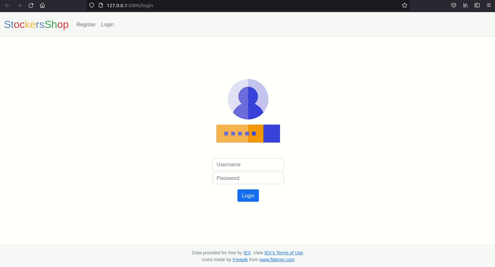

# StockersStop

## PPL mini project

StockersStop is a flask application that uses IEX's API to fetch real-time stock prices for users to quote/buy/sell stocks using virtual currency. This project will help people get acquainted with the stock market and make decisions without worrying about gaining or losing money.

## Install and build

- Optionally, create a virtual environment using pip and venv.

```
python3 -m venv <env_name>
source <env_name>/bin/activate
```

- Install all the requirements using [requirements.txt](requirements.txt).

```
pip3 install -r requirements.txt
```

- We’ll need to register for an API key to be able to query IEX’s data. To do so, follow these steps:

  - Visit https://iexcloud.io/cloud-login/register/
  - After completing registration and confirmation, visit https://iexcloud.io/console/tokens.
  - Copy the key that appears under the Token column (it should begin with pk\_).

- Open a terminal, and execute `export API_KEY=<api_key>`.
- Set the environment to development by executing `export FLASK_ENV=development`.
- Execute `flask run`.
- Open http://127.0.0.1:5000/ in the browser and `StockersStop` is ready to use!

## Demo



## Mentor

Asst. Prof. Vaibhav Khatavkar

## Reference

- https://cs50.harvard.edu/x/2021/psets/9/
